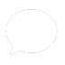
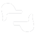
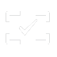
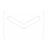
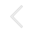
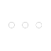
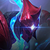
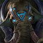
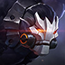

# OpenUI
一个用于 Android 应用开发的个人 UI 收集仓库。

主要包含 `WeChat`、`Emoji`、`LOL`、`王者荣耀`、`Arena of Valor（王者荣耀国际版）`等素材。

制作所用工具 Adobe Photoshop CC 2018、Mozilla Firefox Web Browser、Image Picka 插件等

截图屏幕分辨率 `2160px * 1080px`（红米 Note 5）

声明：本项目仅供学习交流使用，如作他用所承受的法律责任一概与作者无关。

## 格式 
格式统一为： `.png`     
资源文件建议存放于 `drawable-hdpi` 下

### 1 WeChat（当前微信版本为 `6.7.3`）

#### 1.1 底部导航栏
| InActive | name | Active | name |
| - | - | - | - |
|  | ic_chat_inactive |  | ic_chat_active |
|  | ic_contact_inactive |  | ic_contact_active |
|  | ic_discovery_inactive |  | ic_discovery_active |
|  | ic_mime_inactive |  | ic_mime_active |

#### 1.2 Toolbar
| 1 | 2 | 3 | 4 | 5 |
| :-: | :-: | :-: | :-: | :-: |
| 发起群聊 | 添加朋友 | 扫一扫 | 收付款 | 帮助与反馈 |
|  |  |  |  |  |
| menu_faqiqunliao | menu_tianjiapengyou | menu_saoyisao | menu_shoufukuan | menu_bangzhu |
|  |   |  |   | |
| menu_search | menu_add | menu_back | menu_more | |

#### 1.3 “发现” 和 “我” 页面
| “发现” 页面 | 对应中文 | name | “我” 页面 | 对应中文 | name |
| :-: | :-: | :-: | :-: | :-: | :-: |
|  | 朋友圈 | ic_pengyouquan |  | 钱包 | ic_qianbao |
|  | 扫一扫 | ic_saoyisao |  | 收藏 | ic_shoucang |
|  | 摇一摇 | ic_yaoyiyao |  | 相册 | ic_xiangce |
|  | 看一看 | ic_kanyikan |  | 卡包 | ic_kabao |
|  | 搜一搜 | ic_souyisou |  | 表情 | ic_biaoqing |
|  | 附近的人 | ic_fujinderen | | 设置 | ic_shezhi |
|  | 购物 | ic_gouwu |
|  | 游戏 | ic_youxi |
|  | 小程序 | ic_xiaochengxu |

#### 1.4 聊天（单聊 / 群聊相关）
| “+” 页面 | 对应中文 | name | 底部输入框 | 对应中文 | name |
| :-: | :-: | :-: | :-: | :-: | :-: |
|  | 相册 | chat_album |  | 语音 | chat_voice |
|  | 拍摄 | chat_camera |  | 表情 | chat_emoji |
|  | 视频通话（单聊） | chat_voice_call_c2c |  | 键盘 | chat_keyboard |
|  | 视频通话（群聊） | chat_voice_call_c2g |  | 更多 | chat_more |
|  | 位置 | chat_location |
|  | 红包 | chat_red_packet |
|  | 转账 | chat_transfer |
|  | 语音输入 | chat_voice_input |
|  | 我的收藏 | chat_favorites |
|  | 名片 | chat_contact_card |
|  | 文件 | chat_files |

#### 1.5 Emoji（WeChat 100 个版本）

### 2 [Arena of Valor（王者荣耀国际版）](https://www.arenaofvalor.com/web2017/herolist.html)

| 1 | 2 | 3 | 4 |
|:-:|:-:|:-:|:-:|
|  |  |  |  |
| aov_airi | aov_aleister | aov_alice | aov_arduin |
|  |  |  |  |
| aov_arthur| aov_astrid | aov_azzenka | aov_batman |
|  |  |  |  |
| aov_butterfly | aov_chaugnar | aov_cresht | aov_diaochan |
|  |  |  |  |
| aov_fennik | aov_gildur | aov_grakk.png | aov_ignis |
|  |  |  |  |
| aov_ilumia | aov_jinnar | aov_kahlii | aov_kilgroth |
|  |  |  |  |
| aov_kriknak | aov_krixi | aov_lauriel | aov_lubu |
|  |  |  |  |
| aov_lumburr | aov_maloch | aov_mganga | aov_mina |
|  |  |  |  |
| aov_moren | aov_murad | aov_nakroth | aov_natalya |
|  |  |  |  |
| aov_omega | aov_ormarr | aov_peura | aov_preyta |
|  |  |  |  |
| aov_raz | aov_ryoma | aov_skud | aov_slimz |
|  |  |  |  |
| aov_superman | aov_taara | aov_telannas | aov_thane |
|  |  |  |  |
| aov_thejoker | aov_toro | aov_tulen | aov_valhein |
|  |  |  |  |
| aov_veera | aov_violet | aov_wonderwoman | aov_wukong |
|  |  |  |  |
| aov_yorn | aov_zanis | aov_zephys | aov_zill |
|  | | | |
| aov_zuka | | | |

### 3 王者荣耀

### 4 英雄联盟